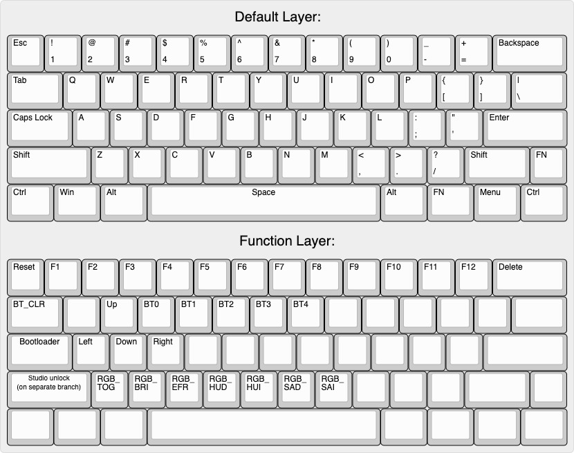
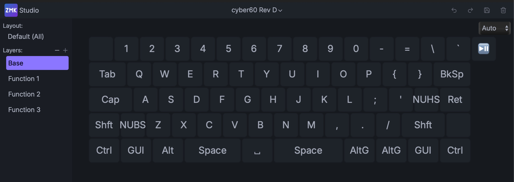

# zmk-config-4pplet

ZMK-config for the cyber60 60% PCB.

# Cyber60
https://github.com/4pplet/cyber60

# Default keymap:

# Keymap-editor and ZMK Studio
The keymap can be edited using ZMK Studio or the keymap-editor tool: https://nickcoutsos.github.io/keymap-editor/

How to get started using the tool and cyber60: https://github.com/4pplet/cyber60/blob/master/instructions/ZMK_keymap-editor.md

The initial ZMK Studio layout that's supports is a "do it all" layout where all keys are exposed for remapping:

# Changes in behaviour of default firmware 2025-04-03
- Sleep enabled by default (45min timeout)
- Buzzer disabled by default (can be enabled in cyber60_rev_X.dts)
- ZMK Studio enabled by default for rev b-e
- Nicks remap tool files (rev d) is kept for reference, ZMK Studio will be the focus going forward
