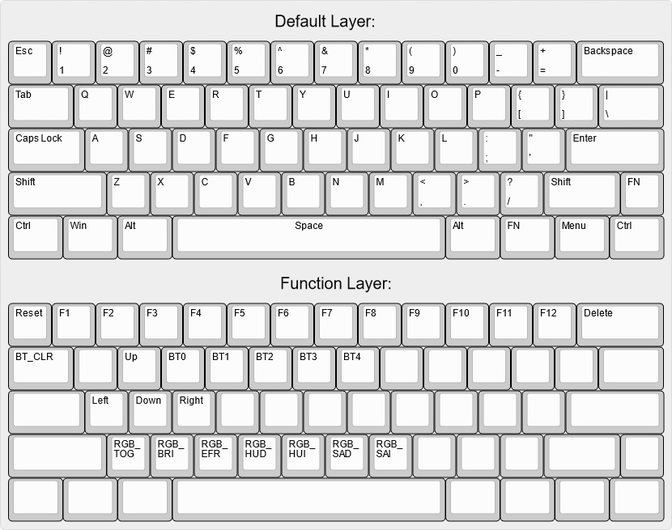

# zmk-config-4pplet

ZMK-config for the cyber60 60% PCB.

# Cyber60
https://github.com/4pplet/cyber60

# Default firmware:

# Keymap-editor
The keymap can be edited using the keymap-editor tool: https://nickcoutsos.github.io/keymap-editor/

Do note: In the default setup for this repo, the keymap for revision D will be edited. To use this tool for revusion B-C, simply move that keymap-file to the /config-folder and delete the current revision D keymap file. 

How to get started using the tool and cyber60: https://github.com/4pplet/cyber60/blob/master/instructions/ZMK_keymap-editor.md

# Status:
- Updated to Zephyr 3.2
- Added support for modifying keymap using the keymap-editor
